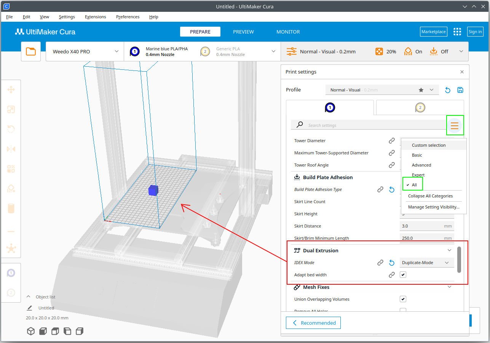

# Cura Idex Plugin for Weedo X40 / X40 PRO

This plugin is based on the Cura Idex plugin by Life0fBrian Brian (https://github.com/Life0fBrian/Cura-IDEX-mode-plugin?tab=readme-ov-file) and was adapted to the Weedo X40 3D printer. The plugin works with Cura 5.X

With the plugin you can easily set the right printing area. Collisions or an incorrect position in duplicate and mirror mode are therefore impossible.

In order for the IDEX plugin option to be displayed, you must set the parameter display to ALL or search for IDEX in the search. You can then find the settings in the Dual Extrusion category.

## Install
In the plugin directory, create a subdirectory called Weedo_X40-Idex-mode-plugin. In this subdirectory create another subdirectory with the same name. Download the Zip-file (green code button). Unpack the contents of the zip-file in this subdirectory and restart Cura.

